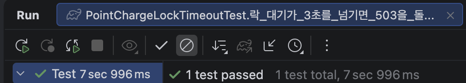
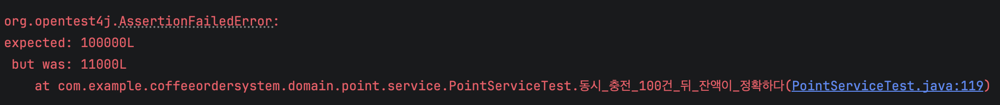
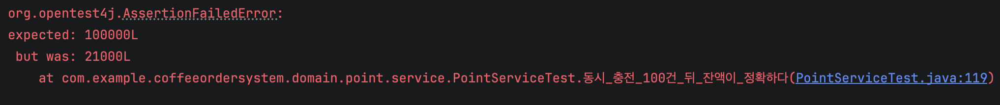
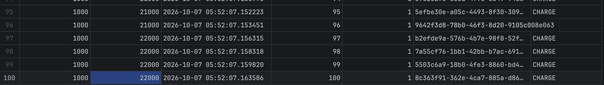
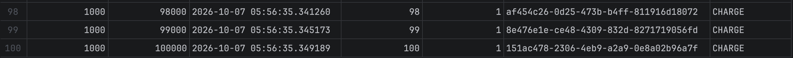
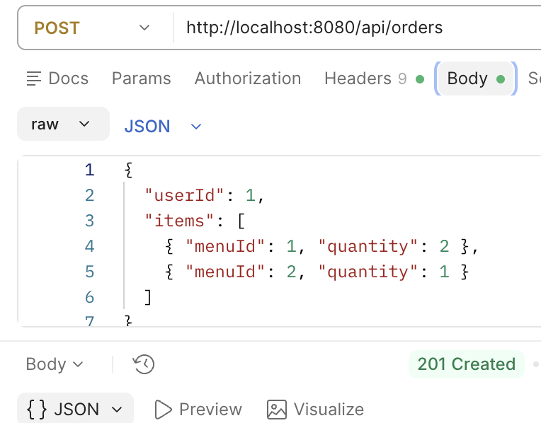
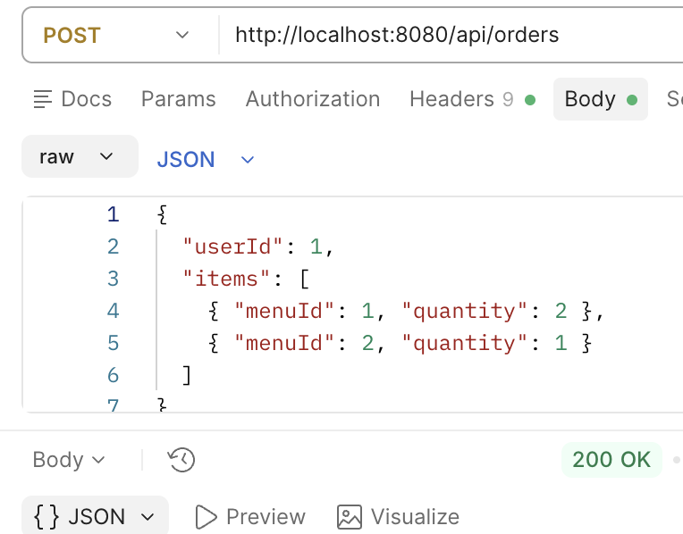
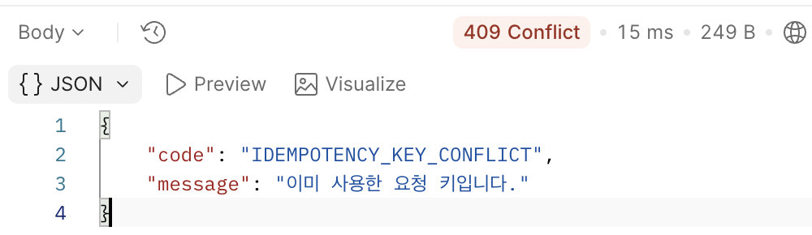

# 커피 주문 시스템

포인트로 결제하는 커피 주문 API입니다. 메뉴 조회, 인기 메뉴 조회, 포인트 충전, 주문 네 가지를
제공합니다.

**동시 요청 정합성, 데이터 일관성, 다수 인스턴스 환경** 세 가지를 어떻게 다룰지에 초점을
뒀습니다. 기능의 가짓수를 늘리는 대신, 같은 자원에 요청이 겹칠 때 데이터가 어떻게 되는지를
직접 재현하고 숫자로 확인하는 쪽에 시간을 썼습니다.

## 기술 스택

| 항목 | 버전 |
|---|---|
| Java | 17 |
| Spring Boot | 4.1.1 |
| Spring Data JPA | Boot 관리 버전 |
| MySQL | 9.7 (Docker) |
| springdoc-openapi | 3.1.0 |

## 실행 방법

JDK 17과 Docker가 필요합니다.

```bash
docker compose up -d     # MySQL 9.7. 호스트 13306 포트, 타임존 +09:00
./gradlew bootRun        # http://localhost:8080
```

`docker compose`가 올라올 때 `coffee`(실행용)와 `coffee_test`(테스트용) 두 스키마를 만듭니다.
애플리케이션은 `ddl-auto: create`로 기동하므로 **띄울 때마다 테이블이 다시 만들어지고
`data.sql` 시드가 들어갑니다.** 사용자 3명, 메뉴 10개, 주문 15건이 들어 있습니다.

API 문서는 `http://localhost:8080/swagger-ui/index.html`에 있습니다.

테스트도 같은 MySQL을 쓰기 때문에 compose가 떠 있어야 합니다.

```bash
./gradlew test
```

테스트는 `coffee_test` 스키마를 사용합니다. 실행용과 분리한 이유는 두 가지입니다.
`@SpringBootTest`도 `ddl-auto: create`를 실행해 떠 있는 앱의 테이블을 날리고, 집계 테스트가
시드 주문 15건과 섞이면 기댓값을 쓸 수 없습니다.

## API

모든 응답은 `{ "code", "message", "data" }` 형태로 감쌉니다. 성공은 `code: "SUCCESS"`에
`message`가 빠지고, 실패는 `data`가 빠집니다.

| 메서드 | 경로 | 설명 | Idempotency-Key | 성공 상태 |
|---|---|---|---|---|
| GET | `/api/menus` | 메뉴 목록. 재고 0이면 `SOLD_OUT` | 불필요 | 200 |
| GET | `/api/menus/popular` | 최근 7일 주문 상위 메뉴 | 불필요 | 200 |
| POST | `/api/points/charge` | 포인트 충전. 응답에 충전 후 잔액 | **필수** | 200 |
| POST | `/api/orders` | 주문. 여러 메뉴·수량 가능 | **필수** | 201 (재요청은 200) |

주문 요청과 응답은 다음과 같습니다.

```http
POST /api/orders
Idempotency-Key: 3f1c2b9e-...

{
  "userId": 1,
  "items": [
    { "menuId": 1, "quantity": 2 },
    { "menuId": 2, "quantity": 1 }
  ]
}
```

같은 키로 다시 보내면 결제가 다시 일어나지 않고 **처음 결과를 그대로 돌려줍니다.** 신규 주문은
`201`, 재요청은 `200`으로 갈립니다. 같은 키에 다른 항목 구성을 보내면 `409`입니다.

| 상태 | code | 언제 |
|---|---|---|
| 400 | `MISSING_IDEMPOTENCY_KEY` | 멱등키 헤더를 보내지 않음 |
| 400 | `INVALID_REQUEST` | 필드 검증 실패, 빈 멱등키, 100자 초과 |
| 400 | `INVALID_ORDER_ITEMS` | 같은 메뉴를 두 항목으로 나눠 보냄 |
| 409 | `INSUFFICIENT_POINT` / `INSUFFICIENT_STOCK` | 잔액·재고 부족 |
| 409 | `IDEMPOTENCY_KEY_CONFLICT` | 같은 키에 다른 본문 |
| 503 | `LOCK_TIMEOUT` | 락 대기가 3초를 넘김 |

## 설계 의도와 근거

### 잔액과 재고는 비관적 락으로 잠급니다

충전과 주문은 **읽은 값을 기준으로 다시 쓰는 연산**입니다. 잠그지 않으면 두 요청이 같은 잔액을
읽고 각자 계산해 덮어쓰기 때문에 한쪽 결과가 사라집니다. MySQL 공식 문서도 이 경우를
명시하고 있습니다.

> "If you query data and then insert or update related data within the same transaction, the
> regular SELECT statement does not give enough protection. Other transactions can update or
> delete the same rows you just queried."
>
> (같은 트랜잭션 안에서 데이터를 조회한 뒤 관련 데이터를 삽입하거나 수정한다면, 일반 SELECT
> 로는 충분히 보호되지 않는다. 다른 트랜잭션이 방금 조회한 그 행을 수정하거나 삭제할 수 있다.)
>
> MySQL 8.4 Reference Manual, Locking Reads

그래서 `users`와 `menus`를 `SELECT ... FOR UPDATE`(JPA `@Lock(PESSIMISTIC_WRITE)`)로 잠급니다.
낙관적 락을 쓰지 않은 이유는 경합 지점이 **인기 메뉴 한 행과 사용자 한 행에 집중되는**
구조이기 때문입니다. 충돌이 드물다는 전제가 성립하지 않는 자리에서는 버전 충돌 뒤 재시도
비용이 락 대기 비용보다 커집니다.

락이 없으면 실제로 얼마나 사라지는지는 직접 재현해 확인했습니다. 아래 `검증`에 있습니다.

### 잠금 순서를 고정하고, 데드락 재시도는 두지 않았습니다

주문은 `users` 한 행과 `menus` 여러 행을 잠급니다. 잠그는 순서가 요청마다 다르면 서로 상대가
쥔 행을 기다려 데드락이 납니다. 그래서 **`users` → `menus`, `menus` 안에서는 메뉴 ID 오름차순**
으로 순서를 고정했습니다.

재시도 루프는 두지 않았습니다. 순서를 지키면 대기 그래프에 순환이 생길 구조가 아닙니다. A가
`users(1)`을 잠그고 `menus(3)`으로 갈 때 B는 `menus(3)`에서 멈추는데, 그 시점에 B가 쥐고 있어
A가 기다릴 만한 것이 없습니다. 잠금 경로가 넷뿐이고 모두 `WHERE id = ?` 단건 조회라 갭 락도
없습니다.

**부하가 늘어도 데드락 확률이 올라가지는 않습니다. 늘어나는 것은 대기입니다.** 그 대기는 아래
타임아웃이 받습니다. 검증하지 않은 방어 코드를 남겨두는 것보다 빼는 쪽이 낫다고 판단했습니다.

### 락 대기는 3초에서 끊고 503으로 돌려줍니다

`innodb_lock_wait_timeout=3`을 세션 변수로 겁니다(`application.yml`의 JDBC URL). 기본값 50초는
요청 하나가 커넥션을 50초간 쥐고 있다는 뜻이고, 그 사이 커넥션 풀이 마릅니다.

타임아웃은 `CannotAcquireLockException`으로 올라옵니다. 이것을 전역 핸들러가 **503**으로
바꿉니다. 서버 버그가 아니라 "지금은 혼잡하니 다시 보내라"는 상태이기 때문입니다. 핸들러를
넣기 전에 테스트를 먼저 써서 500이 나가는 것을 확인했습니다.



### 멱등키는 충전과 주문에서 구현이 다릅니다

둘 다 `Idempotency-Key` 헤더를 받지만 처리 구조가 다릅니다.

| | 충전 | 주문 |
|---|---|---|
| 선조회 위치 | 잠근 **뒤** | 잠그기 **전** |
| 트랜잭션 밖 레이어 | 없음 | `OrderFacade` |

**갈리는 이유는 잠그는 행의 개수입니다.** 충전은 `users` 한 행만 잠그므로, 잠금을 먼저 하고
선조회하면 두 번째 요청이 락에서 기다리다가 첫 번째가 커밋한 뒤 그 이력을 봅니다. UNIQUE
위반에 도달하지 않으니 트랜잭션 밖 레이어가 필요 없습니다.

주문은 잠금 순서가 `users` → `menus`인데 멱등 선조회는 `orders`를 읽는 것이라 잠금보다 앞에 둘
수밖에 없습니다. 그러면 동시 요청 둘이 모두 선조회를 통과할 수 있고, UNIQUE 위반이 난 트랜잭션
안에서는 재조회를 할 수 없습니다(롤백 표시가 붙습니다). 그래서 **선조회 + UNIQUE 제약 + 본문
비교** 세 겹과 트랜잭션 밖 `OrderFacade`가 필요합니다.

`OrderFacade`는 하위 시스템을 묶는 일반적인 Facade가 아니라 **트랜잭션 밖에서 멱등 재조회를
담당하는 얇은 층**입니다. 도메인 조율은 `OrderService`가 합니다. 재고 차감과 포인트 차감이 같이
롤백되려면 한 트랜잭션 안이어야 하기 때문입니다.

### 포인트 이력을 남깁니다

요구사항에는 없습니다. 그럼에도 `point_histories`를 둔 이유는 포인트가 금전 기록이기
때문입니다. 잔액 컬럼만 두면 값이 틀어졌을 때 어디서 틀어졌는지 추적할 수 없습니다. `amount`에
부호를 담아두면 **원장 합과 잔액을 대조해 정합성을 검증**할 수 있고, 실제로 갱신 분실을 재현할
때 이 대조가 원인을 그대로 보여줬습니다.

### 인기 메뉴는 매 요청 집계합니다

최근 7일 주문 항목을 조인해 그때그때 집계합니다. `menus`에 누적 주문 수 컬럼을 두지 않은 이유는
집계 구간이 "최근 7일"이라 누적 카운트로는 구간을 좁힐 수 없기 때문입니다.

캐시는 아직 넣지 않았습니다. 인기 메뉴는 추천이라 초 단위 최신성이 필요하지 않아 캐시의 허용
조건은 만족하지만, **인덱스로 해결되는 범위를 먼저 측정하고 정할 문제**로 뒀습니다.

## 검증

동시성·멱등 테스트 15개에 컨텍스트 로드 1개를 더해 16개입니다. 동시성 테스트에는
`@Transactional`을 붙이지 않습니다. 트랜잭션은 스레드를 넘지 않아 롤백 안전망이 동작하지 않고,
붙이면 테스트 스레드가 쥔 락 때문에 재현 자체가 막히기 때문입니다.

| 클래스 | 개수 | 무엇을 보는가 |
|---|---|---|
| `PointServiceTest` | 5 | 동시 충전 응답, 100건 뒤 잔액, 멱등 3종 |
| `OrderFacadeTest` | 9 | 잔액·재고 경합, 전체 롤백, 잠금 순서, 멱등 3종 |
| `PointChargeLockTimeoutTest` | 1 | 락 대기 3초 초과 시 503 |
| `CoffeeOrderSystemApplicationTests` | 1 | 컨텍스트 로드 |

`./gradlew test` 결과입니다.

```
OrderFacadeTest                     9 tests, 0 failures   1.554s
PointServiceTest                    5 tests, 0 failures   0.589s
PointChargeLockTimeoutTest          1 test,  0 failures   4.674s
CoffeeOrderSystemApplicationTests   1 test,  0 failures   3.019s

BUILD SUCCESSFUL
```

`PointChargeLockTimeoutTest`가 4.6초인 것은 락을 쥔 채 3초를 넘기기를 기다리는 테스트이기
때문입니다.

**검증은 응답이 아니라 DB 상태로 합니다.** 201이 돌아온 것으로 차감이 맞았다고 보지 않고,
테스트 끝에서 잔액·재고·주문 건수를 다시 읽습니다. 동시성 테스트도 예외가 났는지가 아니라
최종 상태가 규칙을 만족하는지를 봅니다.

### 락이 없으면 얼마나 사라지는가

`findByIdForUpdate`를 `findById`로 바꾸고, 잔액 0에 1,000원 충전 100건을 동시에 보냈습니다.

| 커넥션 풀 | 기대 잔액 | 실제 잔액 | 반영된 건수 |
|---|---|---|---|
| 10 (기본값) | 100,000 | **11,000** | 11건 |
| 5 | 100,000 | **21,000** | 21건 |





풀을 절반으로 줄이니 반영된 건수가 두 배가 됐습니다. 동시에 처리되는 수가 곧 같은 잔액을 함께
읽는 수이기 때문입니다.

```
반영되는 건수 = 전체 건수 ÷ 동시에 겹친 수
```

`point_histories`를 열면 원인이 데이터에 남아 있습니다. 같은 `balance_after`가 여러 행에
반복됩니다. 아래 화면에서 97행부터 100행까지 넷 다 21,000을 읽고 넷 다 22,000을 썼습니다.
네 건이 들어갔는데 잔액은 1,000만 올랐습니다.



이력은 100건 그대로이고 `amount` 합은 100,000인데 `users.point`는 그에 못 미칩니다. 원장 합과
잔액을 대조하면 바로 잡힙니다.

```sql
SELECT u.point, SUM(ph.amount) FROM users u
LEFT JOIN point_histories ph ON ph.user_id = u.id GROUP BY u.id, u.point;
```

락을 되돌리면 `balance_after`가 겹치지 않고 1,000씩 올라가 100,000에서 끝납니다.



### 주문 멱등

같은 키로 같은 본문을 두 번 보내면 결제는 한 번만 일어나고, 두 번째는 `200`으로 처음 결과가
나옵니다.






같은 키에 다른 항목 구성을 보내면 `409`입니다.



## 범위에서 제외한 것

동시 요청 정합성, 데이터 일관성, 다수 인스턴스 환경 세 가지에 기여하지 않는 기능은  제외했습니다.
인증·인가, 주문 취소와 환불, PG 연동, 장바구니, 알림 발송, 메뉴 등록·수정과 재고
보충, 주문·포인트 내역 조회가 그렇습니다. 

운영이라면 달라지는 점도 적어둡니다. `userId`를 요청 본문이 아니라 인증 주체에서 얻어야 하고,
품절과 판매 중지는 다른 개념인데 메뉴 수정 API가 없어 후자를 걸 수단이 없습니다.

## 앞으로

| 단계 | 내용 |
|---|---|
| 5 | 주문 내역 전송. outbox 테이블과 워커. 커밋 후 발행을 우회 실험으로 재현해 유실을 보인 뒤 비교 |
| 6 | k6 부하 측정. 재고 락 경합, 인기 메뉴 집계 비용, 인스턴스 수와 처리량. 인덱스로 해결되는 부분을 먼저 확인 |
| 7 | 측정 결과에 따라 Redis 캐시. 인덱스로 충분하면 넣지 않음 |
| 8 | 전송 구현체를 Kafka로 교체하고 브로커 장애를 시연. 성능 개선이 목적이 아님 |

측정 전까지 비워둔 값이 있습니다. 커넥션 풀 크기, outbox 워커 주기와 배치 크기, 캐시 TTL입니다.
숫자를 보고 정합니다.
